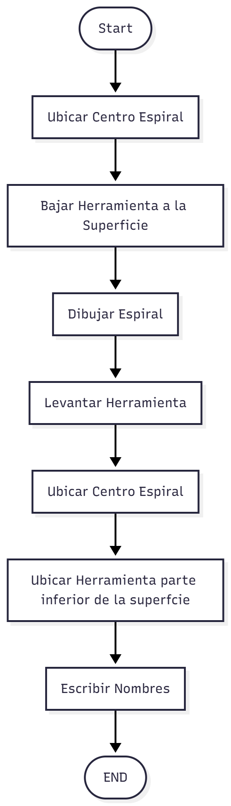

# Laboratorio No. 02 Robótica Industrial - Análisis y Operación del Manipulador Motoman MH6.
El presente laboratorio tiene como propósito analizar y comprender el funcionamiento del manipulador industrial Motoman MH6, explorando sus características técnicas, modos de operación y configuración inicial. A través de la comparación con el robot ABB IRB140, se busca identificar las diferencias en capacidad, alcance, velocidad y aplicaciones, permitiendo así una apreciación más amplia de los diversos tipos de manipuladores empleados en la automatización industrial. Además, se empleará el software RoboDK como herramienta de simulación y control, con el fin de diseñar, ejecutar y validar trayectorias (particularmente una trayectoria polar)tanto en el entorno virtual como en el manipulador físico. De esta manera, el laboratorio contribuye al desarrollo de habilidades prácticas en la programación, simulación y operación de robots industriales, esenciales en el campo de la ingeniería mecatrónica y la robótica aplicada.
## Cuadro Comparativo Motoman MH6 y el IRB140

| Característica                   | Motoman MH6                                | ABB IRB 140                                 |
|----------------------------------|---------------------------------------------|----------------------------------------------|
| Grados de libertad         | 8| 6                                             |
| Carga máxima (payload)           | 6 kg                                        | 6 kg                                         |
| Alcance horizontal (H-reach)     | ~ 1 422 mm                                  | ~ 810 mm                                     |
| Repetibilidad                    | ± 0.08 mm                                   | ~ ± 0.03 mm                                  |
| Velocidades Maximas de las articulaciones | S≈140°/s, L≈130°/s, U≈135°/s, R≈270°/s, B≈270°/s, T≈400°/s | 1≈200°/s, 2≈200°/s, 3≈260°/s, 4≈360°/s, 5≈360°/s, 6≈450°/s |
| Masa del manipulador             | ~ 130 kg                                    | ~ 98 kg                           |
| Montaje                          | Suelo, invertido, ángulo                    | Suelo, invertido, pared/suspensión           |
| Versiones especiales / protecciones | versátil estándar                          | Foundry/Wash/Clean Room, brazo IP67          |
| Aplicaciones típicas             | Manipulación de materiales, tendido de máquinas, embalaje, multiuso | Soldadura por arco, ensamblaje, manipulación, empaquetado, limpieza/pulverizado |

**Nota:El robot Motoman en su modelo orignal solo tiene 6 DOF pero en el laboratorio tiene 8 debido a la banda transportadora en la que se encuentra ensamblado y el soporte rotativo para procesos de mecanizado**

### Conclusiones
- El modelo Motoman MH6 ofrece un alc­ance mayor  comparado con el IRB 140.  
- Para aplicaciones de alta precisión, la repetibilidad del IRB 140  es mejor.  
- Espacio de instalación, montaje y entorno operativo pueden inclinar la elección hacia uno u otro.

## Descripción de Configuración de los homes del Motoman MH6
El robot cuenta con dos posiciones de referencia o home: Home 1 y Home 2.
La posición Home 1 corresponde a una postura retraída del robot, en la que sus ejes se ubican de manera que se reduzcan los esfuerzos y cargas sobre los motores y frenos. Esta posición se utiliza principalmente cuando el robot no va a operar, ya que permite dejarlo en reposo de forma segura, minimizando el desgaste mecánico.
Por otro lado, la posición Home 2 coloca al robot en una postura más “natural”, similar a una forma de L, que es la que normalmente se usa al iniciar las operaciones o para realizar movimientos de trabajo. Sin embargo, esta posición implica un mayor esfuerzo mecánico sobre los motores y la estructura del robot, por lo que no es recomendable dejarlo detenido en ella durante largos periodos de tiempo.
El Home 1 se usa para guardar el robot y proteger sus componentes cuando está inactivo, mientras que el Home 2 se emplea como punto de partida operativo cuando se va a poner en marcha.

## Procedimiento de movimientos Manuales 
Para mover el robot de forma manual se utiliza el modo TEACH. 
  Primero hay que activar los servomotores con el botón SERVO ON READY.
  Luego, se puede cambiar el tipo de movimiento presionando [COORD], lo que permite elegir entre modo articular (JOINT) o cartesiano (BASE, ROBOT o USER).
En el modo articular cada eje (S, L, U, R, B, T) se mueve por separado, mientras que en el modo cartesiano el robot se desplaza siguiendo los ejes X, Y, Z del TCP, manteniendo su orientación.
Los movimientos se hacen con las teclas de eje (+ y –) del teach pendant, y es posible realizar tanto traslaciones como rotaciones.
Antes de moverlo, siempre se debe comprobar que el área alrededor del robot esté libre.

## Niveles de velocidad para movimientos manuales
El robot permite ajustar distintos niveles de velocidad, tanto en los movimientos manuales como en los automáticos.
Cuando se trabaja en modo TEACH, la velocidad de los movimientos manuales se controla directamente con los botones HIGH y SLOW del teach pendant.
Estos botones cambian la velocidad de respuesta del robot, y el nivel actual se muestra en la parte superior de la pantalla con un ícono en forma de triángulo compuesto por barritas, muy parecido al símbolo de señal de los celulares.
Al presionar HIGH, aumenta la velocidad (más barras encendidas), y con SLOW, disminuye (menos barras). Esto permite ajustar la velocidad según la precisión o el espacio disponible de trabajo.

## Principales funcionalidades de RoboDK
RoboDK es una herramienta muy completa para la simulación y programación de robots industriales. En primer lugar, permite agregar una gran variedad de robots y herramientas de diferentes marcas, entre ellas los Motoman de Yaskawa. El entorno de trabajo es totalmente personalizable, ya que se pueden crear sólidos geométricos para representar piezas, mesas de trabajo o cualquier elemento del entorno de producción.
Dentro del programa también es posible crear targets, que son los puntos o posiciones de referencia que el robot debe alcanzar para definir sus trayectorias. Existen tres tipos de trayectorias principales, dependiendo de si el movimiento es articular, lineal o circular. Además, se pueden ejecutar acciones adicionales con la herramienta del robot, como por ejemplo el funcionamiento de una pinza o un sistema de succión para sujetar objetos.
Otra funcionalidad importante es que RoboDK permite visualizar en tiempo real la ejecución del programa que está realizando el robot físico. Esto se logra gracias a la comunicación directa entre el computador y el controlador del robot, en este caso el DX100, conectándolos por cable a la misma red. De esta forma, el programa creado en RoboDK se envía mediante la red al controlador, donde el robot lo interpreta y ejecuta los movimientos exactamente como fueron simulados.

## Comparación RoboDK y RobotStudio
En general, RoboDK es una herramienta mucho más versátil porque permite trabajar con robots de diferentes marcas como Motoman, Fanuc, KUKA o Universal Robots, entre muchas otras. Esto lo hace ideal para entornos educativos o de investigación, donde se utilizan distintos tipos de robots y se busca una plataforma flexible y fácil de usar. Además, su interfaz es bastante intuitiva y permite generar programas de forma rápida, sin necesidad de conocer a fondo el lenguaje propio de cada marca. También se puede programnar sus trayectorias mediante un codigo de Python.
Por otro lado, RobotStudio es un software desarrollado por ABB y pensado principalmente para el entorno industrial. Su gran ventaja es que ofrece una simulación muy realista y detallada del funcionamiento del robot, con herramientas avanzadas y prueba de código en lenguaje RAPID. Sin embargo, su uso está limitado exclusivamente a robots ABB, lo que lo hace menos flexible si se trabaja con equipos de otras marcas.
RoboDK resulta más útil para fines didácticos, proyectos de aprendizaje o prototipado rápido, mientras que RobotStudio es más adecuado para entornos de producción industrial donde se trabaje con robots ABB y se requiera una simulación precisa del comportamiento real del sistema.
## Diagrama de flujo de acciones del robot Motoman MH6

## Plano de planta
## Código desarrollado en RoboDK
Para relizar la programación del robot se hizo por medio de un archivo en lenguaje python donde se usaron los siguientes comandos para realizar los movimientos del robot
-MoveL – Movimiento lineal cartesiano, usado para dibujar letras y trazos rectos.
-MoveJ – Movimiento articular, utilizado para cambios rápidos entre posiciones .
Revisar código Python [ Programa Python - Espiral_Nombres.py](./Espiral_Nombres.py)

## Video de simulación en RoboDK e implementación en robot Motoman MH6
<video src="./video_Funcionamiento.mp4" width="600" controls>
</video>

## Referencias 
- [Motoman MH6 — Especificaciones del producto ](https://www.yaskawa.fr/yaskawa.fr/Robots%20d%27occasion/Brochures/Flyer_Robot_MH6-10_E_06.2014.pdf)  
- [ABB IRB 140 — Especificaciones del producto (3HAC041346-005)](https://library.e.abb.com/public/84e6cb203eef4658839e7cf66e8eaf71/3HAC041346%20PS%20IRB%20140-es.pdf?x-sign=ImRvOsT2Jz0WrduLX2Ku7h+p8psQ+kwuvQhn/UcW7RoyrJUh8FyguShi/V3lJkkI)

