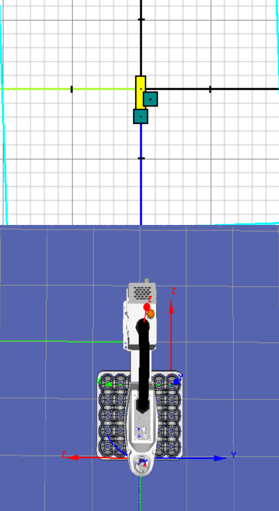

# Laboratorio No. 03 - Robótica Industrial - Análisis y Operación del Manipulador EPSON T3-401S.
El desarrollo de este laboratorio tiene como propósito profundizar en el análisis, operación y comprensión del manipulador industrial EPSON T3-401S, así como establecer una comparación con otros robots utilizados en practicas anteriores, como el Motoman MH6 y el ABB IRB140. A través de actividades prácticas y de simulación, se busca familiarizarse con las configuraciones iniciales del manipulador, los modos de operación manual, el control de velocidad y las funcionalidades del software EPSON RC+ 7.0. Además, se aborda el diseño de un gripper neumático y la ejecución de trayectorias complejas, integrando conceptos fundamentales de robótica industrial y fortaleciendo las competencias necesarias para la operación y programación de robots en entornos reales.
## Comparación de manipuladores industriales

| **Característica** | **Motoman MH6** | **ABB IRB 140** | **EPSON T3-401S** |
|--------------------|------------------|------------------|-------------------|
| **Grados de libertad** | 8 | 6 | 4 (SCARA) |
| **Carga máxima (payload)** | 6 kg | 6 kg | 3 kg (nominal), 6 kg máx. estático |
| **Alcance horizontal (H-reach)** | ~1422 mm | ~810 mm | 400 mm |
| **Repetibilidad** | ±0.08 mm | ±0.03 mm | ±0.02 mm |
| **Velocidades máximas** | S≈140°/s, L≈130°/s, U≈135°/s, R≈270°/s, B≈270°/s, T≈400°/s | 1≈200°/s, 2≈200°/s, 3≈260°/s, 4≈360°/s, 5≈360°/s, 6≈450°/s | Eje 1 ≈ 450°/s, Eje 2 ≈ 450°/s, Eje Z ≈ 700 mm/s, Eje Theta ≈ 1500°/s |
| **Masa del manipulador** | ~130 kg | ~98 kg | ~14 kg |
| **Montaje** | Suelo, invertido, ángulo | Suelo, invertido, pared/suspensión | Suelo |
| **Versiones especiales / protecciones** | Versátil estándar | Foundry / Wash / Clean Room, brazo IP67 | Estándar, grado industrial |
| **Aplicaciones típicas** | Manipulación de materiales, tendido de máquinas, embalaje, multiuso | Soldadura, ensamblaje, empaquetado, limpieza/pulverizado | Pick and place, electrónica, empaquetado, tareas repetitivas de alta velocidad |
## Descripción de las configuraciones Home
# 🏠 Configuraciones Home del robot EPSON T3-401S

A continuación se presentan las configuraciones de las posiciones Home utilizadas para el manipulador SCARA EPSON T3-401S. Estas posiciones sirven como referencia segura para la inicialización del robot y para rutinas que requieren puntos de retorno estables.

---

## 🔹 Home 1 – Configuración principal

El **Home 1** corresponde a la posición de referencia estándar definida por el robot. Desde este punto se realizan los procesos de verificación del sistema y se inicia cualquier programa en EPSON RC+.

### Tabla de configuraciones del Home 1

| Articulación | Tipo de movimiento | Posición Home 1 |
|--------------|--------------------|------------------|
| **J1**       | Rotación base      | 0°               |
| **J2**       | Rotación brazo 2   | 0°               |
| **J3**   | Desplazamiento Z   | Z máximo (arriba)|
| **J4**| Rotación TCP       | 0°               |

## 🔹 Home 2 – Configuración alternativa definida por el usuario

El **Home 2** es una posición alternativa que puede emplearse para minimizar tiempos de desplazamiento, evitar colisiones o facilitar el acceso a rutinas específicas.
### Tabla de configuraciones del Home 2

| Articulación | Tipo de movimiento | Posición Home 2 |
|--------------|--------------------|------------------|
| **J1**       | Rotación base      | 45°              |
| **J2**       | Rotación brazo 2   | –45°             |
| **J3**   | Desplazamiento Z   | Z máximo (arriba)|
| **J4**| Rotación TCP       | 0°               |

## Procedimiento de Movimientos
## Cambios de velocidad 
## Principales Funcionalidades de EPSON RC+ 7.0
## Diseño del Gripper 
## Diagrama de Flujo de la Rutina 
## Plano de Planta 

## Código Desarrollado en EPSONRC+7.0
Se realizo un codigo completo el cual incluye 3 distintas funciones las cuales ayudan a verificar el funcionamiento de las ventosas, recorrer todas las posciones de la cubeta para confirmar que ninguna se encuentra fuera de rango y la ultima que realiza la rutina de mover los huevos por toda la la cuveta solo usando el movimineto en L que realiza el caballo en un tablero de Ajedrez.
Se usaron las siguientes funciones 
    -
## Video Simulacion y Comprobación 
En el video de demostración se evidencia cómo el gripper es capaz de levantar y soltar el huevo de forma adecuada para la práctica, además de presentarse la simulación utilizada para verificar la correcta ejecución de la rutina. Sin embargo, durante la sesión de trabajo no fue posible implementar la trayectoria completa debido al tiempo limitado asignado a cada grupo. Por esta razón, se decidió no utilizar el gripper original del laboratorio y, en su lugar, diseñar uno propio con el fin de restringir el movimiento del TCP únicamente al eje z, evitando desplazamientos en los ejes Z y Y . Como consecuencia de esta decisión, en el video final se observa que el robot realiza un paletizado en diagonal. No obstante, teniendo en cuenta esta situación, la rutina podría ejecutarse sin inconvenientes ajustando correctamente los parámetros del TCP de la herramienta y  de la función pallet, específicamente el punto de origen, el punto en Y y el punto en X.

