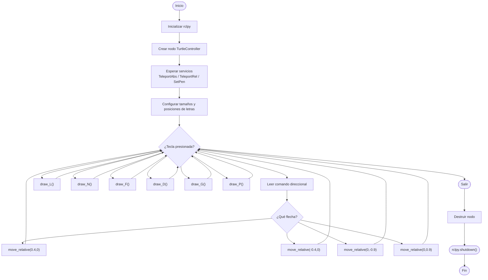

# Laboratorio No. 04 - 2025-II - Robótica de Desarrollo, Intro a ROS 2 Humble - Turtlesim
El presente informe corresponde al Laboratorio No. 04 , cuyo objetivo principal es introducir al estudiante en el uso de ROS 2 Humble y el simulador Turtlesim como entorno base para el control de robots móviles virtuales. Durante la práctica se exploró el funcionamiento de los nodos, tópicos y mensajes dentro del ecosistema ROS, integrando además los comandos esenciales de Linux para la ejecución y gestión del workspace. Como ejercicio central se desarrolló un script en Python capaz de controlar la tortuga de forma manual mediante el teclado y, adicionalmente, programar el dibujo automático de letras basadas en las iniciales del nombre del usuario. Este laboratorio permitió comprender de manera práctica la estructura modular de ROS, afianzar la comunicación entre nodos y fortalecer habilidades de programación orientadas al control de movimiento, logrando así sentar bases sólidas para el desarrollo de aplicaciones robóticas más avanzadas.
## Metodología
### Diagrama de flujo

### Código diseñado
[Programa move_turtle](./move_turtle.py)
### Desarrollo del laboratorio
#### Configuración del ambiente de trabajo
Se creó un workspace de ROS 2 con un paquete dedicado al control de Turtlesim. Dentro de este paquete se editó el archivo move_turtle.py, el cual contiene toda la lógica del nodo, cumpliendo con la restricción de no usar turtle_teleop_key.
Se configuraron los servicios:

/turtle1/teleport_absolute

/turtle1/teleport_relative

/turtle1/set_pen

Cada uno de estos permite:

Posicionar la tortuga en coordenadas específicas

Moverla en relación a su orientación actual

Activar, desactivar y cambiar parámetros del lápiz

El nodo espera a que los servicios estén disponibles antes de iniciar la ejecución.

#### Implementación del control manual
El control manual se realiza mediante la lectura directa del teclado usando tty y termios. Este enfoque permite detectar flechas sin utilizar el nodo turtle_teleop_key.

Asignación de teclas:
- Flecha ↑ → avanzar
- Flecha ↓ → retroceder
- Flecha ← → girar a la izquierda
- Flecha → → girar a la derecha

Estos movimientos utilizan el servicio teleport_relative.

#### Implementación de las letras

El código implementa funciones que dibujan las letras: L, N, F, D, G, P.

Cada letra se define como una secuencia ordenada de puntos, donde cada punto posee coordenada X, coordenada Y y orientación θ.

##### Para dibujar una letra:

- Se apaga el lápiz (off = True).

- La tortuga se mueve al punto inicial mediante teleportación absoluta.

- Se enciende el lápiz con color y grosor específicos.

- Se traza la figura conectando los puntos en orden.

- Se apaga nuevamente el lápiz al finalizar.

#### Funcionamiento del programa

El programa opera en un bucle continuo:

- Lee cada tecla presionada.

- Si es una flecha → movimiento.

- Si es una letra → ejecuta la función correspondiente.

- Si es Q/q → finaliza la ejecución.

El nodo permanece activo hasta recibir la orden de cierre.

### Video de Demostración

## Conclusiones
- La práctica permitió comprender en profundidad el funcionamiento de ROS 2 y su estructura basada en nodos y servicios.
- Se logró interactuar de manera directa con Turtlesim, utilizando servicios como métodos primarios de control.
- La implementación de dibujos mediante secuencias de puntos refuerza el entendimiento de coordenadas y transformaciones dentro del entorno del simulador.
- El laboratorio fortalece la capacidad de integrar Python con ROS 2, promoviendo prácticas esenciales para el desarrollo robótico moderno.
- El uso manual de lectura del teclado permitió conocer técnicas de bajo nivel para recibir entradas sin librerías externas, aspecto útil en interfaces personalizadas.

